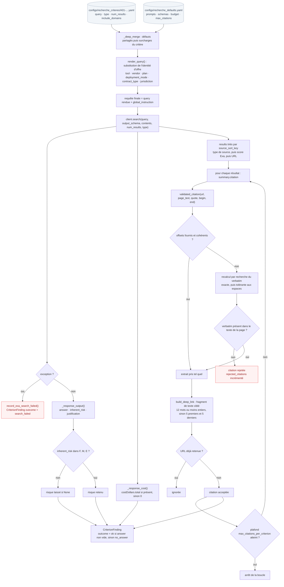

# Cycle de vie d'une recherche de critère

Un critère sur dix-sept, du YAML fusionné jusqu'au `CriterionFinding`. C'est ici que s'applique la règle « rien n'est affiché comme preuve si la citation n'est pas ancrée dans le texte de sa propre page ».

Code de référence : `policybot/contract/exa.py` et `policybot/contract/citations.py`.

