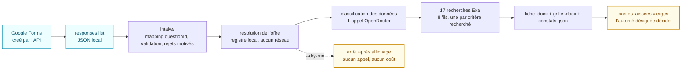
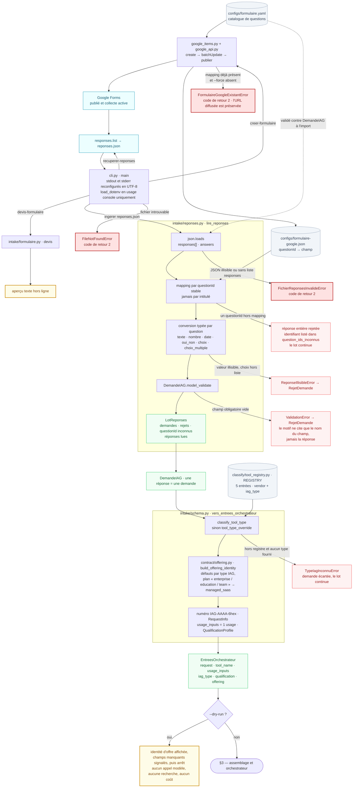
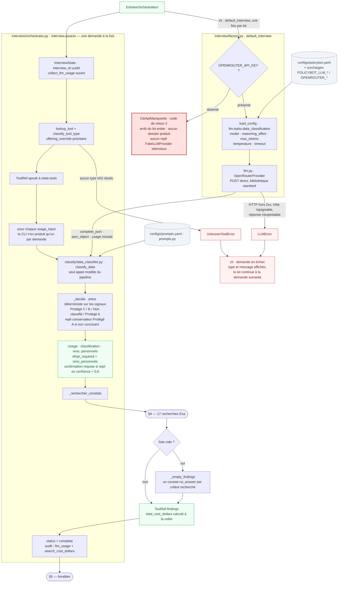
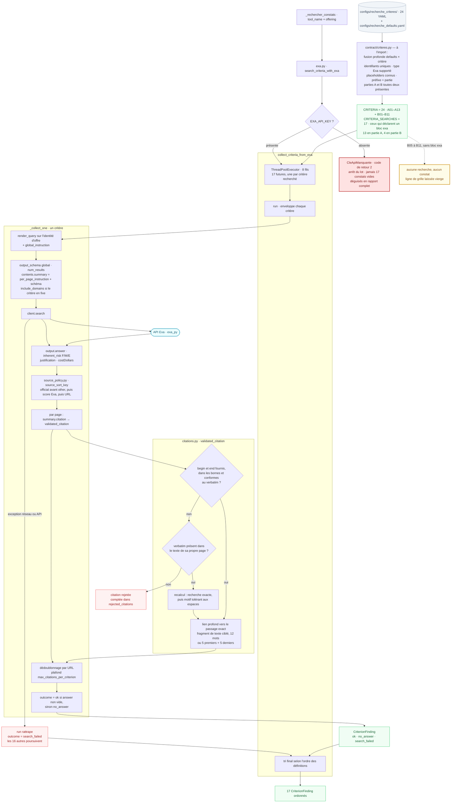
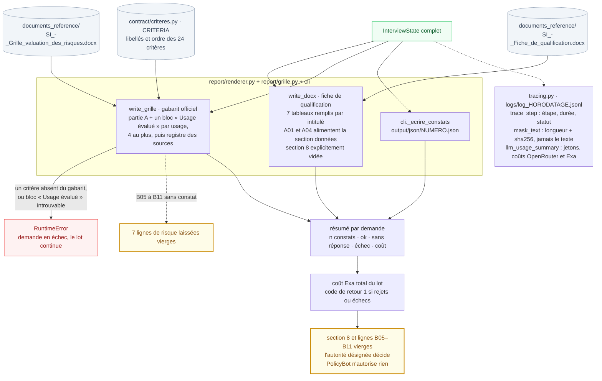

# Pipeline PolicyBot — graphe complet

Le trajet réel d'une réponse Google Forms jusqu'aux livrables. Établi par
lecture du code au 12 août 2026, à l'échelle des paquets `policybot/*`.

Conventions : trait plein, chemin nominal ; pointillé, branche conditionnelle
ou effet de bord ; rouge clair, rejet ou échec isolé qui laisse le lot
continuer ; rouge franc, arrêt de tout le lot ; vert, donnée qui circule ;
gris, configuration lue au démarrage ; jaune, main humaine.

Ce qui n'existe plus dans le code et qu'aucun nœud ne doit représenter : le
cache ARP SQLite et `ArpRecord`, `contract/arp.py`, `contract/cache.py`, le
budget de recherche, le module `criteria.py` et ses constantes `ARP_CRITERIA` /
`USAGE_CRITERIA`, le paquet `policybot/llm/` remplacé par le module unique
`policybot/llm.py`, `preapproved/known_tools.py`, le wizard web et son API.

## 1. Vue d'ensemble

Six étapes. Les deux clés d'API sont les seuls points où le lot entier
s'arrête ; tout le reste dégrade une demande ou un critère à la fois.

## 2. Entrée, lecture et résolution — `cli.py` + `intake/`

La création et le téléchargement touchent le réseau. L'ingestion reste hors
ligne et rejouable ; une réponse illisible est écartée avec son identifiant et
les autres passent.

## 3. Assemblage et orchestrateur — `interview/`

La CLI transmet l'offre déjà résolue par `intake/schema.py` en
`offering_override` : l'orchestrateur refait la résolution du type IAG mais
l'override d'identité l'emporte. Il ne reconstruit l'identité que lorsqu'il est
appelé directement, hors CLI.

## 4. Les dix-sept recherches — `contract/`

Vingt-quatre critères sont déclarés, dix-sept portent une configuration Exa et
sont donc recherchés. Les sept autres — `B05` à `B11` — n'ont aucun bloc `exa:`
et ne produisent aucun constat : leurs lignes de grille restent vierges pour la
main humaine. Les dix-sept requêtes sont indépendantes sur huit fils ; l'échec
de l'une n'atteint pas les seize autres, et l'ordre de sortie est celui des
définitions, pas celui des retours.

## 5. Livrables et traçabilité — `report/` + `tracing.py`

Trois fichiers par demande, puis la décision humaine. Le journal ne contient
aucun texte libre en clair. Les deux rendus s'appuient sur des gabarits Word
repérés par intitulé de tableau : un gabarit modifié fait échouer la demande,
il ne produit pas un document silencieusement incomplet.

</content>
</invoke>
